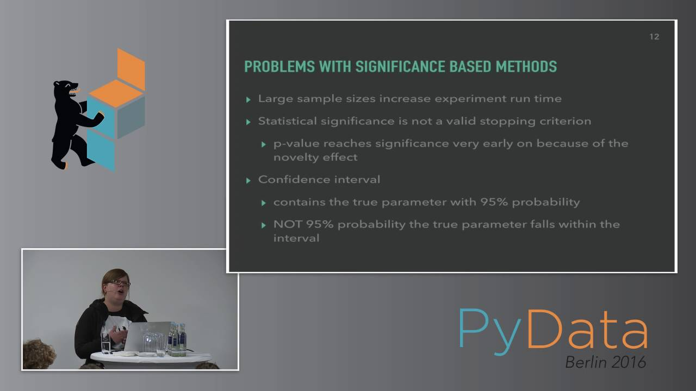

# Bayesian Stats Sources

In this subdirectory of the repository I would like to outline the major sources that I have used to
inform my understanding of bayesian statistics and should be used as a starting point.

I will also outline the strengths and weaknesses of each source so that people can more easily choose
which sources are most relevant for them.

## Online Courses

* Bayesian Stats: From Concept to Data Analysis - [Link](https://www.coursera.org/learn/bayesian-statistics?)

* Bayesian Stats: Techniques and Models - [Link](https://www.coursera.org/learn/mcmc-bayesian-statistics)

* Bayesian ML in Python: A/B Testing - [Link](https://www.udemy.com/bayesian-machine-learning-in-python-ab-testing/)

## Books

* Bayesian Methods for Hackers - [Link](https://github.com/CamDavidsonPilon/Probabilistic-Programming-and-Bayesian-Methods-for-Hackers)

* Think Bayes - [Link](https://greenteapress.com/wp/think-bayes/)

## Conference/Meetup Presentations (Youtube)

* Allen Downey - Bayesian Stats Made Simple (2:57:23) - [Link](https://www.youtube.com/watch?v=TpgiFIGXcT4)

* Allen Downey - Learning to Love Bayesian Statistics - [Link](https://www.youtube.com/watch?v=R6d-AbkhBQ8)

* Nora Neumann - Usable A/B testing, A Bayesian Approach (37:50) - [Link](https://www.youtube.com/watch?v=PSqtcNZDj4A)

* Jake VanderPlas - Frequentism and Bayesianism - [Link](https://www.youtube.com/watch?v=KhAUfqhLakw)

## Blog Posts

* Coding Bayesian AB Tests in Python to Boost your App or Website Conversions - [Link](https://medium.com/@thibalbo/coding-bayesian-ab-tests-in-python-e89356b3f4bd)

* A Zero-Math Introduction to Markov Chain Monte Carlo Methods - [Link](https://towardsdatascience.com/a-zero-math-introduction-to-markov-chain-monte-carlo-methods-dcba889e0c50)
